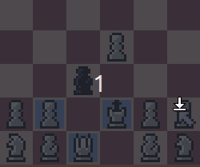
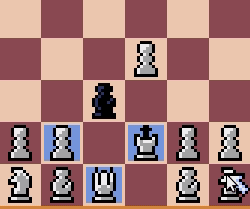

# Xeque
Quando o adversário termina uma jogada deixando o Rei aliado ameaçado ocorre o estado chamado de Xeque. O jogador cujo Rei está em Xeque, pode apenas se movimentar de forma a remover o Rei do perigo. Importante ressaltar que não é permitido um jogador fazer um movimento que deixe o próprio Rei em Xeque.

Os tópicos abaixo visam mostrar como esta mecânica está implementada.

## Seleção de peças em um Xeque
Quando o Rei está em Xeque apenas peças que possuem movimentos válidos (Peças marcadas de ciano) podem ser selecionadas.

## Movimentação em um Xeque
Movimentos válidos em Xeque são representados por ciano, e as capturas são representadas em azul escuro.

## Xeque-mate
Quando o Rei sofre Xeque e não existe nenhum movimento válido que possa remover o Xeque, acontece o Xeque-mate. O jogador que sofreu Xeque-mate perde e o jogo acaba.

Em jogo, após o Xeque-mate, clicar na tela fará o jogo retornar ao menu.
