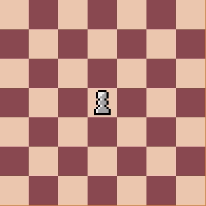
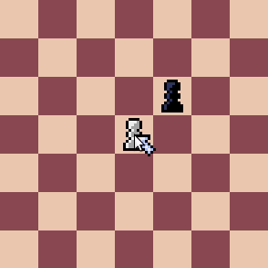
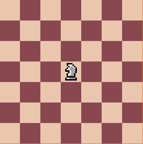
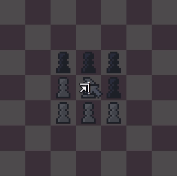
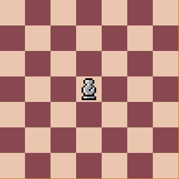
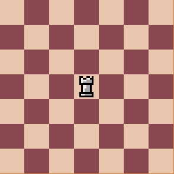
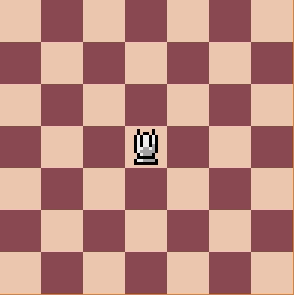
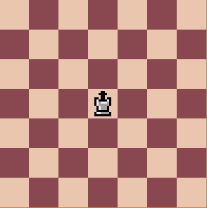

# Movimentos das Peças
No jogo o movimento de todas as peças é indicado quando a peça é selecionada, sendo os quadrados pequenos um movimento e os quadrados grandes a captura. A cor padrão é vermelha, e só muda quando em Xeque. Só é possível se mover para os locais indicados.

Com exceção do peão, todas as peças capturam de forma igual ao movimento. Abaixo está uma breve descrição dos movimentos de cada peça. Há também outros movimentos que podem ser vistos na página **Movimentos especiais**.

## Peão
Os peões podem se mover para frente uma casa, ou duas se for seu primeiro movimento.

O peão é a única peça onde a captura se difere da movimentação, esta ocorre nas duas diagonais frontais do peão.

## Cavalo
Os cavalos se movem em forma de "L", como é possível ver mais claramente no gif abaixo.

O movimento do cavalo tem como diferencial ignorar as peças no caminho, ou seja ele pode passar por cima de outras peças. Isso ocorre independentemente das peças serem aliadas ou inimigas.

## Bispo
O bispos se movimentam qualquer distância diagonalmente.

## Torre
As torres se movimentam qualquer distância cardinalmente.

## Rainha
A rainha combina o movimento da torres com o movimento dos bispos, dessa forma podendo se mover tanto cardinalmente como diagonalmente.

# Rei
O rei possui movimento similar ao da rainha, mas, podendo se mover apenas uma casa.

