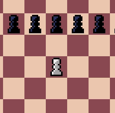
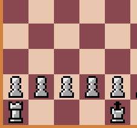
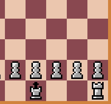
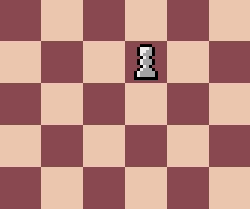

# Movimentos especiais
Além dos movimentos comuns existem alguns movimentos que podem ser considerados especiais, esta página tem o objetivo de mostrá-los. Em jogo só será possível ver o movimento caso todos os requisitos para sua execução estejam cumpridos.  

## Passant
O Passant é um movimento exclusivo do Peão. Só é possível realizá-lo quando um peão do adversário anda 2 casas (Primeiro movimento) e para ao lado de um peão aliado. Quando isso ocorre, é possível mover-se para trás do peão adversário, o capturando no processo.

## Roque
O Roque é um movimento do Rei em conjunto com uma das Torres. Para poder ser realizado nem o Rei nem a Torre selecionada podem ter se movido nenhuma vez e as casas entre as duas peças devem estar livres. Além disso as casas por onde o Rei "passaria" não podem estar sendo ameçadas por uma peça adversária.

O movimento ocorre com o Rei movendo-se duas casas para o lado da Torre desejada, e a Torre é deslocada para o lado do Rei como pode ser visto abaixo.

Quando o Roque é feito com a Torre mais distante chama-se Roque Maior, e com a mais próxima Roque Menor.

## Promoção
Outro movimento exclusivo do Peão. Este ocorre quando um peão chega a última fileira. Na mesma jogada o jogador deve selecionar uma peça para substituir o peão, no caso do jogo aparece uma tela de seleção.

Selecionar uma peça diferente da Rainha, por ser a mais valiosa, chama-se Subpromoção.
